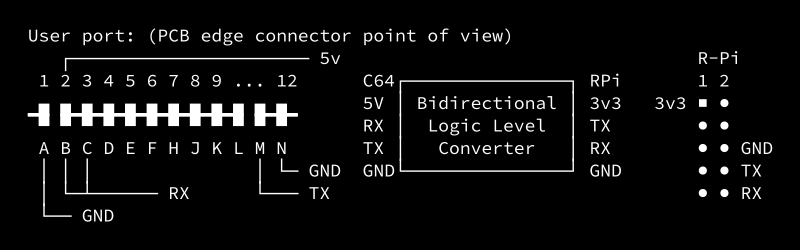

**Commodore 64 serial connection with the Raspberry Pi**


# C64


## BASIC
- source: _C64 programmers reference_
```basic
100 OPEN 3,2,0,CHR$(8) : REM 1200 BAUD 8N1, 3-LINE HANDSHAKE AS LFN#3 (USER SERIAL)
110 GET#3,S$ : REM TURN ON THE RECEIVER CHANNEL
200 REM MAIN LOOP
210 GET K$ : REM GET FROM C64 KEYBOARD
215 IF K$<>"" THEN V=ASC(K$) : IF V>64 AND V<91 THEN K$=CHR$(V + 32)
220 IF K$<>"" THEN PRINT#3,K$; : REM IF A KEY IS PRESSED, SEND TO LFN3
230 GET#3,C$ : REM GET CHAR FROM LFN3
240 PRINT C$; : REM TODO INVERT U-L CASE 
250 SR=ST : IF(SR=0 OR SR=8) THEN 200 : REM CHECK STATUS THEN CONTINUE 
300 PRINT "ERROR: "; : REM ERROR REPORTING
320 IF SR AND 2 THEN PRINT "FRAME"
330 IF SR AND 4 THEN PRINT "RECEIVER BUFFER FULL"
340 IF SR AND 128 THEN PRINT "BREAK"
350 IF (PEEK(673) AND 1) THEN 350 : REM WAIT UNTIL ALL CHARS TRANSMITTED
560 CLOSE 3 : END
```
- The R-Pi side will send mostly lowercase characters. Lowercase characters should be set on the C64 side doing <kbd>SHIFT</kbd>+<kbd>C=</kbd>, otherwise only _drawing characters_ will be displayed.
- Press <kbd>RUN/STOP</kbd> to finish


# R-Pi
- `sudo raspi-config` → Interface Options → Serial Port → Enable "login shell" and "serial port hardware"
- Edit `/boot/cmdline.txt`:
```
console=serial0,1200 console=tty1 root=PARTUUID=5a6cd15b-02 rootfstype=ext4 fsck.repair=yes rootwait quiet splash plymouth.ignore-serial-consoles
```

# TODO
- Translate PETSCII ↔ ASCII and control characters


